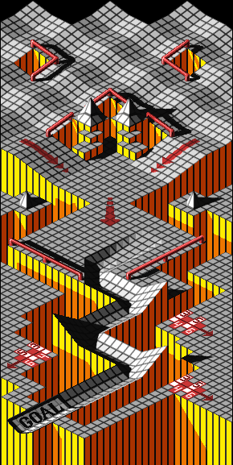

# Marble Madness 3D 🔵⚡

A high-performance modern WebGL & Three.js 3D isometric remake of the 1984 arcade classic **Marble Madness**, complete with full physical course dynamics, mobile rotameter / gyroscope steering, high-resolution thematic stage environments, spatial audio, and real-time multiplayer collisions.



---

## 🎮 Features

- **True 3D Isometric Physics Simulation**:
  - Slope gravity, velocity-dependent traction, banking, and surface resistance (path, grass, sand, water drag, ice, and glass).
  - Custom continuous-slope wedge geometry and collision mesh generation from ASCII course definitions.
  - Interactive stage props: Buzzsaws, bats, bombers, acid snakes, springboards, item crystals, and checkpoints.
- **6 Thematic High-Resolution Stages**:
  1. **Wild Woods** — Mountain ridges, pine forests, and sawmill chutes.
  2. **Arctic Adventure** — Glacial crevasses, ice slides, and igloos.
  3. **Edgy Maze** — Cyberpunk wireframe grid abyss and synthwave geometry.
  4. **Dusty Trail** — Sandstone mesas, desert canyons, and geysers.
  5. **Drillin' Rye** — Underground ore-cart mine shafts and stalactites.
  6. **Space Dementia** — Floating anti-gravity cloud walkways, asteroids, and orbital rings.
- **Hosted Real-Time Multiplayer Mode**:
  - Zero setup, shared-world architecture (no rooms or pairings).
  - Live 3D position, rolling angle, drop-shadow, and billboard nametag synchronization over WebSockets.
  - **Player-vs-Player Bumping**: Collisions knock opponents off balance, trigger spark particles, and award **+250 points** to the attacker with live game-feed notifications.
- **Rich Audio & Sound FX**:
  - Web Audio / HTMLAudio dynamic rolling loop synced to speed.
  - Stage BGM and retro SFX for bounces, springboards, item pickups, checkpoints, and shatter deaths.
- **Universal Controls**:
  - **Mobile**: DeviceOrientation accelerometer (Excel rotameter tilt steering) + on-screen touch joystick and brake.
  - **Desktop**: Mouse drag, Arrow keys / WASD, and Spacebar brake.

---

## 🕹️ Controls

| Control | Desktop | Mobile |
| :--- | :--- | :--- |
| **Steer** | Mouse Drag / Arrow Keys / `WASD` | Device Tilt (Rotameter) / Touch Joystick |
| **Brake** | `Spacebar` / Mouse Down | On-screen **BRAKE** button |
| **Restart** | `R` key | Menu button |
| **Menu** | `ESC` key | Course Select button |
| **Mute** | `M` key | Menu toggle |

---

## 🚀 Quick Start

### 1. Installation

```bash
npm install
```

### 2. Build the TypeScript Bundle

```bash
npm run build
```

### 3. Launch the Game & Multiplayer Server

```bash
npm start
```

Visit **`http://localhost:3000/`** in your browser (or connect multiple browser windows/devices on the same local network to play together in real time).

---

## 🏗️ Project Architecture

```
marblemadness/
├── index.html            # Main UI, responsive viewport, HUD, minimap & joystick
├── package.json          # Dependencies (Three.js, ws, esbuild, TypeScript)
├── tsconfig.json         # TypeScript configuration
├── tools/
│   ├── build.mjs         # Fast esbuild bundle generator
│   ├── serve.mjs         # HTTP + WebSocket multiplayer server
│   └── validate-levels.mjs # Offline ASCII level and height delta validator
├── src/
│   ├── main.ts           # Game lifecycle entry point
│   ├── audio.ts          # SoundManager (BGM, SFX & dynamic pitch roll loop)
│   ├── lib/constants.ts  # Simulation, physics, camera, and scoring constants
│   ├── data/
│   │   ├── kinds.ts      # ASCII DSL glyphs & surface definitions
│   │   ├── types.ts      # Level layout, patch, and hazard interfaces
│   │   ├── build.ts      # Multi-pass terrain grid and slope compiler
│   │   └── levels.ts     # Complete definitions for all 6 arcade stages
│   └── game/
│       ├── input.ts      # Multi-modal input (accelerometer, touch, mouse, keyboard)
│       ├── physics.ts    # Marble kinematics, slopes, bounds, and collisions
│       ├── hazards.ts    # Dynamic enemies, items, and checkpoint triggers
│       ├── hud.ts        # HUD rendering, 2D minimap, live feed, and course select
│       ├── renderer.ts   # Three.js 3D isometric scene, panoramic skyboxes, lighting
│       ├── multiplayer.ts# WebSocket client, interpolation & marble collision impulses
│       └── state.ts      # Central GameManager state machine
└── www/
    ├── audio/            # Optimized MP3 sound assets
    ├── images/           # High-resolution stage reference graphics
    └── bundle.js         # Compiled ES module bundle
```

---

## 📜 License

MIT License. Arcade assets and designs homage to Atari Games (1984).
